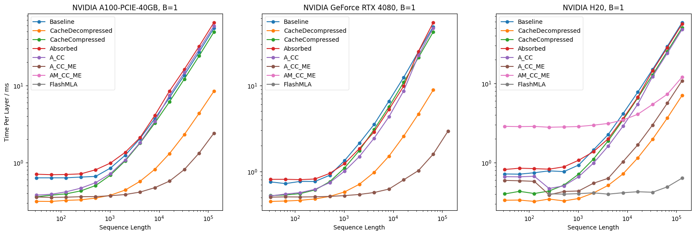
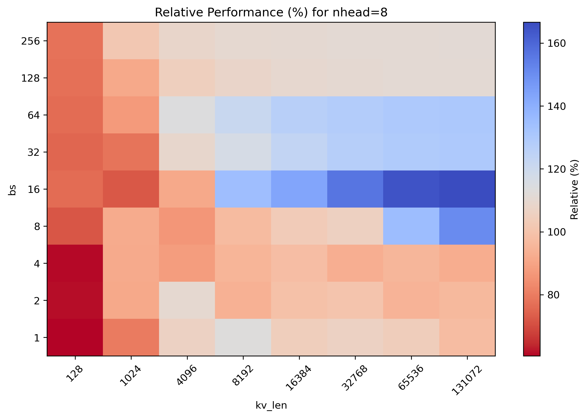
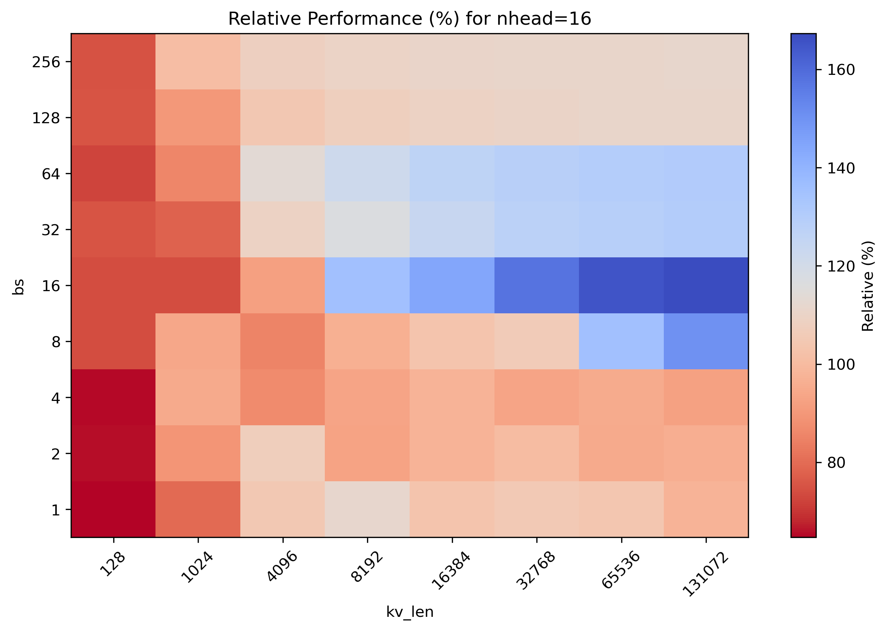

之前在 [FlashMLA 源码分析](https://zhuanlan.zhihu.com/p/27257803590) 分析了 FlashMLA 的源码，后来我又实践了一下，在此记录一下进一步的学习成果。

实验平台： Hopper 架构的 H20 GPU。

本文中所涉及的全部代码的地址：[https://github.com/Zhao-Dongyu/mla-profile](https://github.com/Zhao-Dongyu/mla-profile)

实验是基于 [ZHANG Mingxing​](https://www.zhihu.com/people/james0zan) 的 [deepseekv2-profile](https://github.com/madsys-dev/deepseekv2-profile) 基础上进一步完成的。具体的代码讲解和 MLA 原理可以参考 [DeepSeek-V2 高性能推理 (1)：通过矩阵吸收十倍提速 MLA 算子](https://zhuanlan.zhihu.com/p/700214123) 或者 [optimizing-mla.md](https://github.com/madsys-dev/deepseekv2-profile/blob/main/workspace/blog/optimizing-mla.md) ，这是本文的基础。同时也声明一下，本文大部分内容都摘自原作者的 [optimizing-mla.md](https://github.com/madsys-dev/deepseekv2-profile/blob/main/workspace/blog/optimizing-mla.md)。


# 实验结果

先上实验结果：



# 版本说明

## 简要汇总

|版本|说明|
|---|---|
|Baseline|使用 pytorch 的基础实现mla版本（用来理解MLA计算过程）|
|CacheDecompressed|将先前迭代过程中KV向量的值缓存下来（凸显 kv cache 重要性）|
|CacheCompressed|MLA通过多头共用压缩后的KV表示（mla精髓：减少显存占用）|
|Absorbed|将KV的解压缩矩阵吸收到Q-projection和Out-projection中（mla灵魂）|
|Absorbed_CacheCompressed|在 Absorbed 版本基础上使用kv cache|
|Absorbed_CacheCompressed_MoveElision|采用MoveElision优化策略（进一步优化）|
|AM_CC_ME|Materializing Projection Matrices（无效的尝试）|
|FlashMLA|接入 FlashMLA 算子（进入cuda算子战场）|
|FlashInfer|接入 FlashInfer 算子（与 FlashMLA 进行PK）|


## baseline 版本

`mla/impl/baseline.py`

Attention的计算过程和传统的MHA并无差异。首先计算attention score：

$$ a = \mathrm{softmax}\left(\frac{q_t^\top k_t + \mathrm{Mask}}{\sqrt{192}}\right) \in \mathbb{R}^{B \times L \times H \times L} $$

计算对V的加权和，并将所有head压平，得到Attention输出：

$$ o = a \cdot v_t \in \mathbb{R}^{B \times L \times H \times 128} \cong \mathbb{R}^{B \times L \times 16384} $$

经过另一个矩阵的投影，就能得到MLA的最终输出：

$$ u = W^O o \in \mathbb{R}^{B \times L \times 5120} $$


> baseline 就是一个基础的实现版本，没做 kv cache，我认为可以不用过多关注。

## cache_decompressed 版本

`mla/impl/cache_decompressed.py`

在原始的transformer模型的decoding过程中，每次迭代都需要计算所有token对应的的KV向量，这部分的计算往往会带来较大的开销。实际上，每次迭代过程中，这些KV向量的值都是一样的；因此，我们可以采用“空间换时间”的策略，将先前迭代过程中KV向量的值缓存下来，这样在后续的迭代过程中，就不需要重复计算KV向量了，从而大大减小了模型推理过程中的计算量。

> cache_decompressed 版本是加了 kv cache 的，这才是主流的部署方法，这个版本可以当作最终对比的真正的`baseline`~


## cache_compressed 版本

`mla/impl/cache_compressed.py`

到了这个版本，就步入正题了，改为缓存压缩后的KV Cache 以及 RoPE后的k_pe。

这个改动的优势就是mla的精髓--

> 在 cache_decompressed 版本中，使用KV cache后，虽然计算量减小了，但是显存占用量以及显存带宽需求却急剧上升，成为了制约大模型推理效率的**新瓶颈**。MLA的设计通过多头共用压缩后的KV表示，大幅减少了KV cache的占用。

两种实现的KV Cache占用和计算量如下表：

| 实现版本 | 每token每层Cache大小 | 每token每层计算量 |
| :---: | :---: | :---: |
| CacheDecompressed (CD) | 81.92 kB | 0.08 MFLOP |
| CacheCompressed (CC) | 1.152 kB | 33.64 MFLOP |

CacheDecompressed策略可以节省浮点计算量，但其显存占用量却很大。这使得CacheDecompressed的瓶颈很容易卡在显存容量和显存带宽上。

而CacheCompressed的显存占用却少了约98.6%。但要注意计算量变大了（多了投影矩阵的计算）。由于Compressed KV在每个head中都参与了计算，DeepSeek-V2的128个heads能够提供足够的计算强度，因此Attention部分的MFU也得到了大幅提高。

我认为这个表非常明显的展示出了 mla 的特性：

- （1）确实是真的省显存；
- （2）虽然提升了计算强度，但也确实加大了计算量(这个版本计算量非常多)

## absorbed 版本

`mla/impl/absorbed.py`

这个版本跳过（没有使用kv cache）

## absorbed_cache_compressed 版本

`mla/impl/absorbed_cache_compressed.py`

在cache_compressed 版本中， 计算MLA的时候，仍然需要存储解压后的完整的KV Cache，这很可能引起 OOM 崩溃。

```python
kv = self.kv_b_proj(compressed_kv) \
    .view(bsz, kv_seq_len, self.num_heads, self.qk_nope_head_dim + self.v_head_dim) \
    .transpose(1, 2)
```

此时，mla的另一个精髓出现了————做吸收，或者说是交换计算顺序。

将KV的解压缩矩阵吸收到 Q-projection 和 Out-projection 中，从而可以在不解压缩 KV Cache 的情况下直接计算最终的 Attention 结果。

对于K的吸收，在 Attention Score 的计算公式中，非 RoPE 部分可以做如下展开：

$$
{q_t^C}^\top k_t^C = (W^{UQ} c_t^Q)^{\top} W^{UK} c_t^{KV} = {c_t^Q}^{\top}{W^{UQ}}^{\top} W^{UK} c_t^{KV} = ({c_t^Q}^{\top}{W^{UQ}}^{\top} W^{UK}) c_t^{KV} 
$$

即通过矩阵乘法结合律，可以改为计算 $({c_t^Q}^{\top}{W^{UQ}}^{\top} W^{UK})$ ，避免了解压缩出完整的K矩阵。此外，在原始版本的解压缩的过程中，由于每个token的key都需要与 $W^{UK}$ 相乘才能得到，因此计算量较大；矩阵吸收后， $W^{UK}$ 只需要对 $q_t^C$ 这一个向量相乘，也大大减少了浮点计算量。

对于V的吸收，则是吸收到后面的 $W_o$ 矩阵那边。

> 我认为矩阵吸收这部分真是神之一笔，膜拜设计这个算法的大佬。

## absorbed_cache_compressed_move_elision 版本

`mla/impl/absorbed_cache_compressed_move_elision.py`

> 在原始代码中，query_states和key_states会通过拼接RoPE和非RoPE部分得到，拼接过程会产生大量无用的数据拷贝和广播，同时也会占用大量显存空间导致OOM。为此，我们采用MoveElision优化策略，
即省略此处的拼接RoPE部分和非RoPE部分的过程，而是直接分别计算量部分的额Attention Score并相加

$$ a = \mathrm{softmax}\left(\frac{q_t^\top k_t + \mathrm{Mask}}{\sqrt{192}}\right) = 
\mathrm{softmax}\left(\frac{{q_t^C}^\top k_t^C + {q_t^R}^\top k_t^R + \mathrm{Mask}}{\sqrt{128 + 64}} \right)
\in \mathbb{R}^{B \times L \times H \times L} $$

这样，得到了以下四个版本的优化实现：

| 实现版本 | 每token每层Cache大小 | 每token每层计算量 |
| :---: | :---: | :---: |
| CacheDecompressed (CD) | 81.92 kB | 0.08 MFLOP |
| CacheCompressed (CC) | 1.152 kB | 33.64 MFLOP |
| Absorbed_CacheCompressed (A_CC) | 1.152 kB | 0.28 MFLOP |
| Absorbed_CacheCompressed_MoveElision (A_CC_ME) | 1.152 kB | 0.28 MFLOP |

## absorbed_materialized_cache_compressed_move_elision 版本

`mla/impl/absorbed_materialized_cache_compressed_move_elision.py`

DeepSeek-V2的论文中说：
> ..., we can absorb $W^{UK}$ into $W^{UQ}$, and $W^{UV}$ into $W^O$.

对模型参数进行预处理，$W^{UK}$与$W^{UQ}$相乘后的结果可以视为$H$个大小为$1536 \times 512$的低秩（不超过128）矩阵，而$W^{UV}$与$W^O$相乘的结果可以视为$H$个大小为$5120 \times 512$的低秩矩阵。相比用这些特别大的低秩矩阵做投影，明显不如按照低秩分解形式依次相乘来得划算。

事实确实也是这样。

## flash_mla 版本

`mla/impl/flash_mla.py`

我是在 absorbed_cache_compressed 版本的基础上移植了 flash_mla 版本。

需要注意的有几点：

1. 输入的`query_states` 是做过 `absorbed` 之后的结果

2. `flash_mla_with_kvcache` 得到的 attn_output，记得先 `out_absorb` 再 `o_proj`

3. **一定要手动传入 `softmax_scale`！** 官方的 FlashMLA 的代码如果不传入的话，给的是`softmax_scale = q.shape[-1] ** (-0.5)`，这非常具有误导性。因为这时候q的最后一维是576，softmax_scale不应该用这个来算（应该使用 192 或者需要进一步考虑YaRN）

## flash_infer 版本

`mla/impl/flash_infer.py`

集成起来和 flash_mla 版本差不多，只是我运行前需要需要 `export TORCH_CUDA_ARCH_LIST="9.0+PTX"`

# 实验结果分析


1.看前两张图 ZHANG Mingxing 的结果，趋势基本是一样的，性能最好的是棕色的 `absorbed_cache_compressed_move_elision` 版本，在A100上，sequence length = 131072, B = 1 的情况下，这个版本速度是 `cache_compressed` 版本的 `0.049090097627292/0.00240414586383849 = 20.4`倍，效果非常显著。

2.FlashMLA开源代码是针对mla特定shape写的算子，目前还没有集成 move_elision 操作，所以在我的H20实验上没有做相关实验。

3.最右侧的第三张图相比前两个结果显得乱七八糟甚至结论相反，这主要是和我用的 H20 平台有关：


| 参数/型号 	                         |H100 SXM	 |H100 PCIe	  |H20 	      |H800 SXM	    |H800 PCIe	|
|---                                    |---        |---        |---         |---         |---|
| **架构** 	                            |Hopper 	 |Hopper 	 |Hopper      |	Hopper |	
| **显存容量** 	                         |80GB       |80GB       |96GB        |80GB        |	80GB    |	
| **显存带宽** 	                         |3TB/s 	 |2TB/s 	 |4.0TB/s 	  |3.35TB/s    |2TB/s 	|
| **FP64 算力（TFLOPS）** 	             |30 	     |24 	     |1 	      |1 	       |0.8 	|
| **FP32 算力（TFLOPS）** 	             |60 	     |48 	     |44 	      |67       	|51 	|
| **BF16/FP16 Tensor Core 算力（TFLOPS）** |2,000 	 |1,600 	 |**148** 	 |1,979 	|1,513 	|
| **INT8/FP8 Tensor Core 算力（TFLOPS）** |4,000 	 |3,200 	 |296 	 |3,958 	|3,026 	|
| **NVLink 带宽** 	                    |900GB/s 	|600GB/s 	|**900GB/s** |400GB/s 	|400GB/s 	|
| **PCIe 带宽** 	                    |Gen5: 128GB/s 	 |Gen5: 128GB/s 	 |Gen5: 128GB/s 	 |Gen5: 128GB/s 	 |Gen5: 128GB/s 	|

[H100数据来源](https://images.nvidia.cn/aem-dam/en-zz/Solutions/data-center/h100/nvidia-h100-datasheet-nvidia-a4-2287922-r7-zhCN.pdf), [H20数据来源](https://www.an-link.com/Se_d_gci_47_id_13.html), [H800数据来源](https://chaoqing-i.com/upload/20231128/NVIDIA%20H800%20GPU%20Datasheet.pdf)

H20和H800都是基于H100的“阉割”版本，只不过阉割方向不一样。

H20是英伟达对算力进行了非常暴力的阉割的版本（AI算力只有H100的不到15%），而带宽非常强悍，这就导致H20这个平台对算力更加敏感，以至于 decoding 阶段本来是 `memory bound` 的一个阶段，活生生接触到了 `computing bound`？

做 `materialized` 的 AM_CC_AE版本耗时非常高，这是因为加大了计算量。 橙色的CD版本耗时反而低，这是因为CD版本的计算量很少。不过，MLA 更大的作用还是显著降低 KVCache 的显存开销，所以还是有必要压缩的。

另外，FlashMLA表现优异，不愧是精心配制过的 Cuda 算子，不过拿 FlashMLA 和一堆 pytorch 实现的版本比较有些耍流氓了，所以考虑和 FlashInfer 进行PK。

---

遗憾的是，在这个 profile 里面不太容易对 FlashInfer 这种 JIT 的做测量，测出来的时间明显偏大，于是采用了[abcdabcd987/2025-02-23-mla-flashinfer-vs-deepseek.py](https://gist.github.com/abcdabcd987/b215c5f00f4b5e8399b95d7933bcf475) 的代码进行单独的实验。

分别实验了 nhead = 8（TP=16） 和 nhead = 16（TP=8） 的情况：




    这个热力图画的是二者的速度的比值，颜色越蓝表示 FlashMLA 相比 FlashInfer 速度越快，颜色越红则表示 FlashInfer 速度越快。

可以看到，在 kv_len > 8192 以及 bs >=8 的时候， FlashMLA 才有明显优势。

当然以上结论是针对 H20 平台得出的，猜测在H800上，两个 warp group 的计算访存分配比较合理，性能表现会好得多。


可惜我只有H20能用，那么下一步的计划也就很明确了：

- 调整 FlashMLA 的 warp group 的计算访存分配，提升性能；
- 去学习 FlashInfer，结合二者的优点搞事情。

# 附：运行脚本

- 跑benchmark

    `python3 -m mla.benchmark B 1024`

    `python3 -m mla.benchmark B 1024 --repeat=1`

- 跑一致性

    `python3 -m mla.test B 1024`

- 跑性能

    `python workspace/blog/data/runner.py`

- FlashMLA vs FlashInfer

    `python flashinfer_vs_flashmla/flashinfer_vs_flashmla.py`

仓库里有的代码图测试方便，考虑的不周全，欢迎提PR～

认识理解不到位的地方，欢迎大佬们指正～